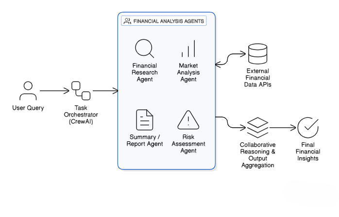

# 🧠 Multi-Agent Financial Analysis AI

## Overview
This project implements a **multi-agent AI system** for financial analysis using **CrewAI** and **Google Gemini**. Multiple specialized AI agents collaborate to analyze financial data, assess market conditions, evaluate risks, and generate structured insights.

---

## Architecture

## Agents

Each agent has a dedicated role:

- **Financial Research Agent** – Analyzes financial data and key metrics  
- **Market Analysis Agent** – Evaluates market trends and macro factors  
- **Risk Assessment Agent** – Identifies financial and operational risks  
- **Report Agent** – Combines all outputs into a clear summary  

This role-based design improves modularity and explainability.

---

## Task Workflow

- The user submits a financial query.
- CrewAI orchestrates and assigns tasks to the appropriate agents.
- Each agent independently performs reasoning using the LLM.
- Agent outputs are consolidated into a single, structured response.
  

---

## Technology Stack

- **Language Model:** Google Gemini  
- **Agent Framework:** CrewAI  
- **LLM Integration:** LangChain  
- **Language:** Python  
- **Environment:** Jupyter Notebook  

---

## Key Features

- Modular multi-agent architecture  
- Scalable and extensible design  
- Clear separation of responsibilities  
- Suitable for financial research and decision support  

---

## Use Cases

- Investment analysis  
- Market research  
- Risk assessment  
- Financial reporting  
